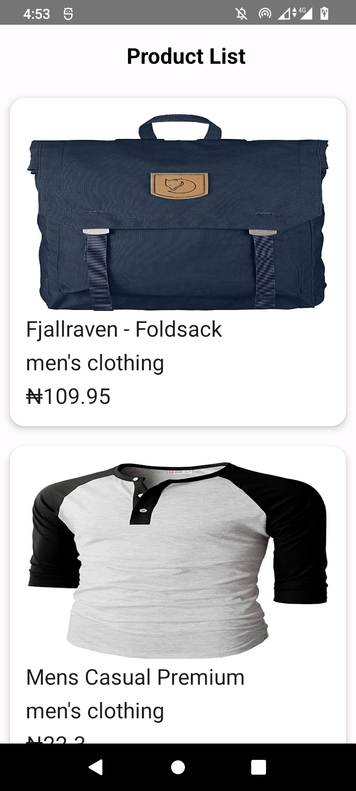
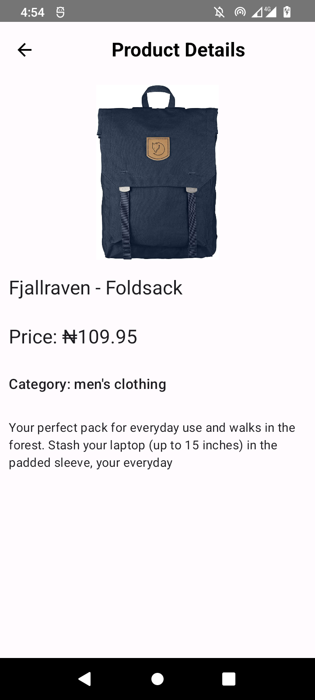

# Product Explorer App

Product Explorer is an Android application that allows users to explore a list of products fetched from a remote API, view product details, and cache data for offline use. The app is built with **Jetpack Compose**, **Room**, **Retrofit**, and **Hilt** to showcase modern Android development practices.

---

## Features
- View a list of products fetched from the Fake Store API.
- Click on a product to view detailed information.
- Offline support: Cached data is available when no internet connection is detected.

| **Product List**                                | **Product Details**                                   | **Offline Support**                                   |
|-------------------------------------------------|-------------------------------------------------------|-------------------------------------------------------|
|  |  |  |


## Tools and Technologies
- **Jetpack Compose**: For building modern UI.
- **Room**: Local database for offline caching.
- **Retrofit**: For networking and API integration.
- **Hilt**: Dependency Injection framework for modular and testable code.

---

## How to Clone and Run the Project in Android Studio

Follow these steps to clone and run the project on your local machine:

1. **Clone the Repository**:
    - Open a terminal and run:
      ```bash
      git clone https://github.com/your-username/ProductExplorerApp.git
      ```
    - Replace `your-username` with your actual GitHub username.

2. **Open in Android Studio**:
    - Launch Android Studio.
    - Click on **File > Open**.
    - Navigate to the folder where you cloned the repository and select it.

3. **Sync Gradle**:
    - Gradle sync will start automatically. If it doesn’t, click on **File > Sync Project with Gradle Files**.

4. **Run the Project**:
    - Connect an Android device via USB or start an emulator.
    - Click on the green "Run" button or use the shortcut **Shift + F10**.

5. **Grant Necessary Permissions**:
    - Ensure the app has **internet permission** for fetching products. It is already included in the `AndroidManifest.xml`.

---

## Trade-offs and Improvements
### Trade-offs:
- The search functionality was not implemented due to time constraints.
- Used `fallbackToDestructiveMigration` during development for database schema changes.

### Future Improvements:
- Add a search bar to filter products by name or category.
- Implement pagination for the product list to handle large datasets.
- Add more detailed error handling and retry mechanisms for network failures.

---

## License
This project is licensed under the MIT License. Feel free to use and modify it for your own purposes.
